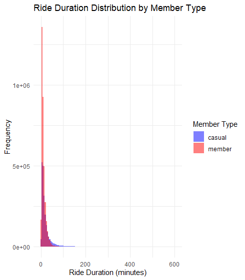
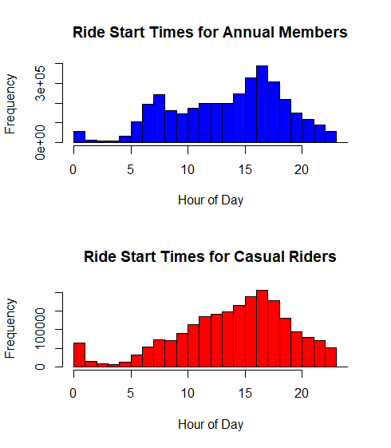

# Google Data Analytics Capstone

## Context
### About the company
In 2016, Cyclistic launched a successful bike-share offering. Since then, the program has grown to a fleet of 5,824 geotracked bicycles and locked into a network of 692 stations across Chicago. The bikes can be unlocked from one station and returned to
any other station in the system anytime. 
Until now, Cyclistic’s marketing strategy relied on building general awareness and appealing to broad consumer segments. One approach that helped make these things possible was the flexibility of its pricing plans: single-ride passes, full-day passes, and
annual memberships.

## Opportunity
Cyclistic’s finance analysts have concluded that annual members are much more profitable than casual riders. Although the pricing flexibility helps Cyclistic attract more customers, they believe that maximizing the number of annual members will be key to
future growth. Rather than creating a marketing campaign that targets all new customers, they believe there is an excellent chance to convert casual riders into members, given that casual riders are already aware of the Cyclistic program and have
chosen Cyclistic for their mobility needs.

## Process
### Data Preparation
  - Data from 13 different months (September 2022 to September 2023) were imported using the read_csv function.
  - The datasets were checked for compatibility and merged into a single dataset (data_all) using rbind.
  - The dataset was examined for duplicate ride IDs, and none were found (anyDuplicated(data_all$ride_id)).
  - Unique categories for rideable_type and member_casual were identified: "electric_bike", "classic_bike", "docked_bike" and "casual", "member" respectively.

### Data Analysis
Here's a list of steps taken and questions that arose during the analysis:
  - Filter out rides shorter than or equal to 1 minute and longer than 600 minutes. Calculate summary statistics after filtering
  - It logical to have rides without start_station and end_station info (neither id or name)? 
    - Can bikes be picked up and left anywhere?
    - Does this happen in any group in particular?
  - Could we eliminate these entries and still have relevant data?
  - Create a grid of plots based on ride duration and member type.
    - The vast majority of data falls into the 0-100 group. How many rides would we exclude if we focus on this group?

#### Ride Duration Distribution:
  Rides with durations of less than 1 minute and over 10 hours were filtered out. The data was then analyzed for ride duration distribution.
  It was observed that 99.8% of rides were within 100 minutes.
  
#### Start and End Station Information:
  Rides with missing start and end station information were examined. 6.8% of rides had incomplete station details.
  This phenomenon was more prominent in the "electric_bike" group, affecting 44.4% of casual riders and 55.6% of annual members.

#### Ride Duration by Member Type:
  Ride duration distributions were visualized for both casual and annual members.
  It was noted that both groups had similar distributions with the majority of rides being within 20 minutes.
  
  
    
   
  
  <!--   
  
  
    
  -->
  

  
#### Popular Routes:
  Routes were analyzed based on start and end stations to identify the most frequently used routes for casual and annual members.
  ### Top Routes for Annual Members
  - Ellis Ave & 60th St to University Ave & 57th St (6,401 rides)
  - Ellis Ave & 60th St to Ellis Ave & 55th St (6,138 rides)
  - University Ave & 57th St to Ellis Ave & 60th St (5,872 rides)
  
  ### Top Routes for Casual Riders
  - Streeter Dr & Grand Ave to Streeter Dr & Grand Ave (8,471 rides)
  - DuSable Lake Shore Dr & Monroe St to DuSable Lake Shore Dr & Monroe St (6,632 rides)
  - DuSable Lake Shore Dr & Monroe St to Streeter Dr & Grand Ave (5,275 rides)

    
